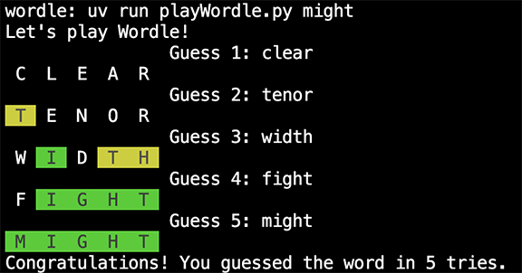

# Learn python by creating code to play Wordle

Working with the GitHub Copilot agent, you will create code that allows you to
play the Wordle game, now
[hosted by the NY Times](https://www.nytimes.com/games/wordle/index.html).
The program will be given the secret word of the day (the answer), and then
allow the user up to six chances to guess the word, giving back color-based
clues about which letters they got right.
The primary purpose of this project is for you to get experience writing Python
code and using VSCode and Copilot.

## Sample run

You don't have to match this format exactly. Only requirement is that you use colors 
to show matches.  I found that adding spaces to each side of each letter produced 
a more appealing presentation.

## Important student setup instructions to get colored text

This project will use the termcolor library to allow you to generate colored text
(e.g., white on green letters).

You need to perform several steps before you can run code that depends on the
termcolor library. You can start implementing the project before completing this
setup, and even run code that simply prints out color names or letters, rather
than colored text, if you have any problems completing this setup.

We assume you are using [uv](https://docs.astral.sh/uv/) for
python dependency management;
if you are using something else, you will need to adapt the setup instructions.

* You should already have [uv installed](https://docs.astral.sh/uv/getting-started/installation/)
* Open the project in VS Code and open a terminal window inside VS Code.
In that window, type the following commands:
  * `uv venv` - this will create a virtual environment for your project. Because
    you are running this within a VS Code terminal window, VS Code may/should
    show a pop-up saying "We noticed a new environment has been created. Do you
    want to select it for the workspace folder?" Select yes.
    * If you don't get the pop-up, open the command pallette (Command-Shift P),
      type `Python`, select "Python: Select Interpreter", and select
      `./.venv/bin/python`, which should be the recommended option.
  * `uv sync` - This installs the termcolor library the project depends on. The
    dependency on termcolor comes from the pyproject.toml file.
  * `uv run testColor.py` - this should print white on red text, showing that
    the project and VSCode can handle the use of the termcolor library.

## The project is set up for coaching mode

The project is set up so that Copilot won't just give you a proposed solution
when you type the name of the function you want to implement. Typical 
VS Code + Copilot behavior has been changed in two ways:

* A rules file is read by the GitHub agent and guides the agent to act as a
coach helping you to learn python and implement the project. You can fully
implement the project by just having a conversation with the agent and letting
it write the code. Or you can also edit parts of the code yourself.
* Autocomplete suggestions have been disabled, because autocomplete ignores the
rules file, and will sometimes generate 20+ lines of code just based on the
function name.

You can primarily or exclusively generate the code for project by typing in the
chat window, rather than the edit window for the playWordle.py file. The coach
should be able to take a description of some code you want written and turn that
into 1-6 lines of python code. Larger chunks of functionality may need to be
broken down into several rounds of code generation. It should be able to just
add the code to the playWordle.py file, although we have seen cases where you
will need to tap the "Apply in Editor" button, ask it to update the file, or
manually cut-and-paste the code.

## Requirements for wordle project

Put your code in playWordle.py; when run as a script it should take a command
line argument that is the word to be guessed (the answer).

It should then ask the user to guess a word, and then repeat the word, color
coded to show how it matched the answer:

* White on green for a correct letter in the right place
* White on yellow for a correct letter in the wrong place
* White on black for a wrong letter

Note that each letter of the answer can only be used to match against one letter
of the guess, so if the guess was HELLO and the answer was SLANT, only the first
of the L's in the guess would be marked as a correct letter in the wrong place.
For the guess TENOR and target MINTY, the T in TENOR would be yellow, and the
N would be green; the other letters would be black.  

If the user guesses the answer, after showing the all-green word, it should
congratulate the user, say how many guesses it took, and terminate.  

If the user makes 6 unsuccessful guesses, it should tell the user the answer,
say better luck next time and terminate.

Otherwise, it should ask the user for their next guess and repeat the above.

The code should use the termcolor library for colorizing text.

## Tips for figuring out how to implement wordle

If you have trouble figuring out how to implement wordle, ask the agent for help in
figuring out how to break the program down into functions, and then the
strategy/algorithms for each function, before you actually ask it to write code.
In addition to the code for the main function, you will likely want to define two
or more additional functions. Think about creating functions that have a well
defined purpose, and can be tested or run independently of playing an entire
wordle game.

## How VS Code was put into coaching mode

The instructions in `.github/copilot-instructions.md` provide instructions about
how chat in agent mode should work for this project. The `.vscode/settings.json`
file turns off automatic code completion suggestions.  

The initial part of the copilot-instructions was developed from a discussion with
Claude Code set to have [learning mode output style](https://docs.anthropic.com/en/docs/
claude-code/output-styles), which gave it access to the custom instructions Claude Code
uses for learning mode. The custom instructions specifically instruct the model to
anticipate that students already have experience programming in Java and C, but need
help learning Python syntax, data structures, library methods, and idioms.

The last part of it was written by GPT 4.1, after VS Code, following the above
instructions, still generated entire function bodies when just given the
information for the function header.
